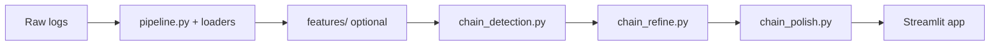
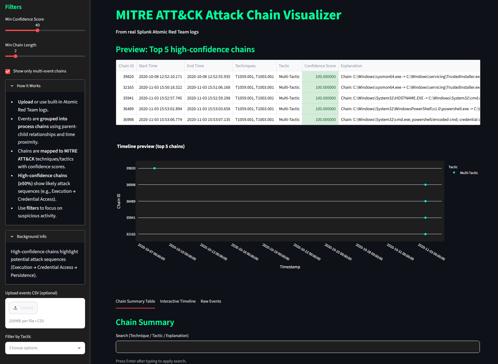

# MITRE ATT&CK Chain Visualizer

Process trees and event chains hide real attack behavior inside overwhelming EDR/Sysmon telemetry. This project groups related events into **scored, explainable attack chains**, maps them to MITRE ATT&CK techniques and tactics, and presents them on an interactive timeline—inspired by [SentinelOne Storyline](https://www.sentinelone.com/blog/rapid-threat-hunting-with-deep-visibility-feature-spotlight/) and [CrowdStrike Falcon](https://www.crowdstrike.com/platform/endpoint-security/falcon-insight-xdr/) behavioral graphing.

---

## 🎯 Problem & Motivation

Signature-based detection and static indicators struggle with novel techniques and living-off-the-land binaries. SOC analysts still face thousands of disconnected process-creation events where the meaningful signal is the **sequence**: Execution → Credential Access → Persistence.

This project addresses that gap by:

- Grouping events into process chains via parent–child relationships and time proximity
- Mapping chains to MITRE ATT&CK with **confidence scores** and human-readable explanations
- Surfacing **multi-event chains** first—the highest-signal attack storylines
- Providing an analyst-friendly timeline with filters, hover detail, and CSV export

Interpretability and triage are built in. Confidence gating reduces noise; every highlighted chain includes context an analyst can act on—practical design for security operations workflows.

---

## 🛠️ Tech Stack


| Layer | Tools |
|-------|-------|
| **Data processing** | Python, Pandas, NumPy |
| **Visualization** | Plotly, Streamlit |
| **Detection** | Rule-based chain construction + weighted confidence scoring |
| **Deployment** | [Streamlit Cloud](https://streamlit.io/cloud) |

---

## 📊 Data Sources & Attribution

This project uses curated attack simulation logs from the [Splunk Attack Data repository](https://github.com/splunk/attack_data) (Apache License 2.0).

**Datasets used** (from `atomic_red_team` subfolders):

| Technique | Name | Raw log sources |
|-----------|------|-----------------|
| **T1059.001** | Command and Scripting Interpreter: PowerShell | `windows-sysmon`, `windows-powershell` |
| **T1003.001** | OS Credential Dumping (LSASS) | `windows-sysmon`, `crowdstrike_falcon` |
| **T1003.003** | OS Credential Dumping (NTDS) | `windows-sysmon`, `crowdstrike_falcon` |
| **T1547.001** | Boot or Logon Autostart: Registry Run Keys | `windows-sysmon` |

**License compliance**  
© Splunk Inc. — Apache License 2.0. No affiliation with Splunk, CrowdStrike, SentinelOne, or MITRE. Data used solely for educational and research purposes.

**Raw logs are not committed.** Download them locally into `data/raw/<technique_id>/` (e.g. `data/raw/T1059.001/windows-sysmon.txt`) when rebuilding the pipeline from scratch.

---

## 🏗️ Architecture & Design Choices

**Pipeline flow:** Raw logs (Sysmon, PowerShell, CrowdStrike Falcon) are loaded and normalized ([`src/pipeline.py`](src/pipeline.py), [`src/loaders/`](src/loaders/)) into a unified schema. Optional feature engineering ([`src/features/`](src/features/)) enriches events with cmdline and parent–child signals. **Chain detection** ([`src/chain_detection.py`](src/chain_detection.py)) groups events by process lineage and time windows. **Refinement** ([`src/chain_refine.py`](src/chain_refine.py)) applies technique rules, confidence scoring, benign-root filtering, and explanations. **Polish** ([`src/chain_polish.py`](src/chain_polish.py)) prepares UI-ready summaries. The **Streamlit** dashboard ([`app.py`](app.py)) loads polished chains or uploaded CSVs, filters by confidence/length/tactic, and renders an interactive timeline.

**Key design decisions:**

- **Chain-level analysis** — Techniques and tactics are inferred from multi-event sequences, not isolated rows
- **Confidence gating** — Default filters (≥40% confidence, multi-event only) surface analyst-ready storylines
- **Interpretable output** — Every chain includes techniques, tactic color, and a plain-language explanation
- **Reproducibility** — Pipeline writes staged CSVs under `data/processed/` for audit and rebuild (only polished outputs are committed)

### Development Journey

Initially explored per-event rule-based and ML classification approaches (RandomForest, ensembles, SMOTE). While some signals were captured, accuracy plateaued due to heavy event overlap and PowerShell dominance in the Atomic Red Team data. Pivoted to process chain detection and timeline visualization—a more practical, industry-aligned solution that better surfaces meaningful multi-stage attack sequences (Execution → Credential Access → Persistence), mirroring tools like SentinelOne Storyline and CrowdStrike Threat Graph. Earlier classification experiments are preserved in [`archived/`](archived/).



**Pipeline outputs** (`data/processed/` — only polished files are committed to GitHub):

| Stage | Events | Summary |
|-------|--------|---------|
| Chain detection | `events_with_chains.csv` | `chains_summary.csv` |
| Refined | `events_with_chains_refined.csv` | `chains_summary_refined.csv` |
| Polished (UI-ready, **committed**) | `events_with_chains_polished.csv` | `chains_summary_polished.csv` |

---

## 🚀 Live Demo
**Demo video**  
*Coming Soon*

**[▶ Open the live app on Streamlit Cloud](https://mitre-attack-chain-visualizer.streamlit.app/)** <!-- replace with deployed URL --> 

The live app loads pre-built polished chains from `data/processed/`. Raw Splunk Attack Data logs are not included—download them separately to rebuild from scratch. You can also upload your own Sysmon/EDR CSV via the sidebar (recommended limit ~50 MB on Streamlit Cloud free tier).

**Screenshot** 



---

## Quick Start

### 1. Clone and install

```bash
git clone https://github.com/rvong65/mitre-attack-chain-visualizer.git
cd mitre-attack-chain-visualizer
pip install -r requirements.txt
```

### 2. Run the dashboard

The repo includes **polished chain outputs** (`data/processed/events_with_chains_polished.csv` and `chains_summary_polished.csv`) so the app works immediately after clone—no raw logs required.

```bash
streamlit run app.py
```

Open **http://localhost:8501**.

### 3. Rebuild from raw logs (optional)

Raw Atomic Red Team logs are **not** committed (license/size). To regenerate all pipeline outputs:

1. Download logs from [Splunk Attack Data](https://github.com/splunk/attack_data) `atomic_red_team` subfolders for T1059.001, T1003.001, T1003.003, T1547.001.
2. Place files in `data/raw/<technique_id>/` (e.g. `data/raw/T1059.001/windows-sysmon.txt`).
3. Run the pipeline:

```bash
python -c "from src.pipeline import run_pipeline; run_pipeline()"
python -m src.features.pipeline
python -m src.chain_detection
python -m src.chain_refine
python -m src.chain_polish
streamlit run app.py
```

Outputs are written to `data/processed/` (gitignored except the polished pair).

### Alternative: upload a CSV

Use the sidebar uploader with a Sysmon/EDR events CSV (`timestamp`, `process_path`, `cmdline`, `parent_process`)—no local pipeline required.

### Development (optional)

Install dev dependencies and run tests locally:

```bash
pip install -r requirements-dev.txt
pytest tests/ -q
```

Loader and feature tests skip automatically when `data/raw/` or intermediate processed files are missing. Chain-detection smoke tests run without raw logs.

---

## ✨ Features

- **Pre-built polished chains included in repo** — explore attack chains immediately after clone; optional rebuild from Splunk Attack Data
- **Upload your own Sysmon/EDR CSV** — validation, size checks, graceful error handling
- **Filter by confidence, chain length, and tactic** — focus on high-signal activity
- **Interactive timeline** — Plotly scatter with hover explanations, cmdline snippets, tactic coloring
- **Chain summary table** — confidence-coded cells (green / yellow / red tiers)
- **Export filtered chains as CSV**

**Expected upload columns** (minimum): `timestamp`, `process_path`, `cmdline`, `parent_process`.

---

## 🛡️ Safety Considerations

This is a **simulation and visualization tool only**. It uses static attack simulation data—no live execution or network activity. Confidence gating and explanations are designed to support analyst triage, not replace production EDR or SIEM solutions. Do not upload sensitive production telemetry to public deployments without authorization.

---

## 📈 Project Status & Build Log

| Step | Focus |
|------|-------|
| **1 — Data** | Load and unify Sysmon, PowerShell, and Falcon logs; unified schema |
| **2 — Features** | Cmdline patterns, parent–child links, technique-specific signals |
| **3 — Pivot** | Archived per-event ML; shifted to chain-level detection |
| **4 — Chains** | Parent–child + time proximity grouping; technique rules |
| **5 — Refine** | Confidence scoring, benign filtering, explanations |
| **6 — Polish** | Tactic colors, summary tables, multi-event gating |
| **7 — UI** | Streamlit dashboard: dark theme, filters, timeline, export |
| **8 — Deploy** | Upload validation, readability fixes, Streamlit Cloud |

**Current status:** ✅ MVP complete — polished demo data committed, CSV upload, and export ready for Streamlit Cloud.

---

## 📁 Repository Layout

```
mitre-attack-chain-visualizer/
├── app.py                    # Streamlit dashboard (entry point)
├── requirements.txt          # Runtime deps (Streamlit Cloud)
├── requirements-dev.txt      # Dev deps (pytest); not used on deploy
├── data/
│   ├── raw/                  # Local only (gitignored) — Splunk Attack Data logs
│   └── processed/            # Polished demo CSVs committed; other outputs gitignored
├── src/
│   ├── pipeline.py           # Load & normalize raw logs
│   ├── chain_detection.py    # Build process chains
│   ├── chain_refine.py       # Score & explain chains
│   ├── chain_polish.py       # UI-ready polish step
│   ├── features/             # Feature extraction (optional enrich)
│   └── loaders/              # Sysmon, Falcon, PowerShell parsers
├── archived/                 # Early per-event classification experiments (source only)
└── tests/
```

---

## 📄 License

**MIT License** — see [LICENSE](LICENSE).

**Data attribution:** Splunk Attack Data — [Apache License 2.0](https://github.com/splunk/attack_data/blob/master/LICENSE).

---

## 🤝 Contact / Next Steps

Open to feedback, suggestions, and mission-aligned collaboration.

**Potential future directions** *(no promises on timeline)*:

- STIX/TAXII export for SIEM integration
- Graph-database backend for large-scale chain queries
- LLM-assisted chain summarization (with guardrails)
- Additional Atomic Red Team techniques and data sources
- Docker image for reproducible local + cloud deployment

---

<p align="center">
  <sub>Built with real Splunk Atomic Red Team telemetry · MITRE ATT&CK® is a registered trademark of The MITRE Corporation</sub>
</p>
