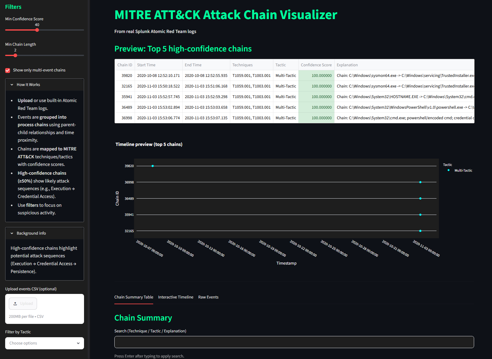
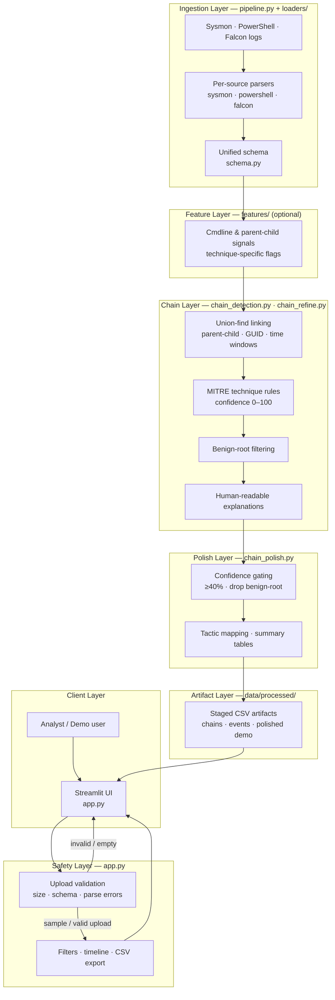

# MITRE ATT&CK Chain Visualizer

Process trees and event chains hide real attack behavior inside overwhelming EDR/Sysmon telemetry. This project groups related events into **scored, explainable attack chains**, maps them to MITRE ATT&CK techniques and tactics, and presents them on an interactive timeline—inspired by [SentinelOne Storyline](https://www.sentinelone.com/blog/rapid-threat-hunting-with-deep-visibility-feature-spotlight/) and [CrowdStrike Falcon](https://www.crowdstrike.com/platform/endpoint-security/falcon-insight-xdr/) behavioral graphing.

[](https://mitre-attack-chain-visualizer.streamlit.app/)

---

## Table of Contents

**Get started**
- [Live Demo](#live-demo)
- [Features](#features)
- [Quick Start](#quick-start)

**Overview**
- [Problem & Motivation](#problem-motivation)
- [Tech Stack](#tech-stack)
- [Data Sources & Attribution](#data-sources)

**Technical**
- [Architecture & Design Choices](#architecture-design-choices)
  - [Development Journey](#development-journey)
- [Safety Considerations](#safety-considerations)
- [CI/CD](#cicd)
- [Project Status & Build Log](#project-status)
- [Repository Layout](#repository-layout)

**Legal & contact**
- [License](#license)
- [Contact / Next Steps](#contact)

---

<a id="live-demo"></a>

## 🚀 Live Demo

**[▶ Open the live app on Streamlit Cloud](https://mitre-attack-chain-visualizer.streamlit.app/)**

**Before you open the app:**
- **Cold start:** This app runs on Streamlit Community Cloud and may go to sleep after inactivity. If you see **“Zzzz — This app has gone to sleep due to inactivity”**, click **“Yes, get this app back up!”** to wake it — anyone can do this; you don’t need to contact the maintainer. Startup may take a minute after you click.

**Note:** The live app loads pre-built polished chains from `data/processed/`. Raw Splunk Attack Data logs are not included—download them separately to rebuild from scratch. You can also upload your own Sysmon/EDR CSV via the sidebar (recommended limit ~50 MB on Streamlit Cloud free tier).

**Screenshot:**



---

<a id="features"></a>

## ✨ Features

- **Pre-built polished chains included in repo** — explore attack chains immediately after clone; optional rebuild from Splunk Attack Data
- **Upload your own Sysmon/EDR CSV** — validation, size checks, graceful error handling
- **Filter by confidence, chain length, and tactic** — focus on high-signal activity
- **Interactive timeline** — Plotly scatter with hover explanations, cmdline snippets, tactic coloring
- **Chain summary table** — confidence-coded cells (green / yellow / red tiers)
- **Export filtered chains as CSV**

**Expected upload columns** (minimum): `timestamp`, `process_path`, `cmdline`, `parent_process`.

---

<a id="quick-start"></a>

## Quick Start

### 1. Clone and install

```bash
git clone https://github.com/rvong65/mitre-attack-chain-visualizer.git
cd mitre-attack-chain-visualizer
python -m venv .venv
source .venv/bin/activate   # Windows: .venv\Scripts\activate
pip install -r requirements.txt
```

### 2. Run the dashboard

The repo includes **polished chain outputs** (`data/processed/events_with_chains_polished.csv` and `chains_summary_polished.csv`) so the app works immediately after clone—no raw logs required.

Activate `.venv` if it is not already active, then:

```bash
streamlit run app.py
```

Open **http://localhost:8501**.

### 3. Rebuild from raw logs (optional)

Raw Atomic Red Team logs are **not** committed (license/size). To regenerate all pipeline outputs:

1. Download logs from [Splunk Attack Data](https://github.com/splunk/attack_data) `atomic_red_team` subfolders for T1059.001, T1003.001, T1003.003, T1547.001.
2. Place files in `data/raw/<technique_id>/` (e.g. `data/raw/T1059.001/windows-sysmon.txt`).
3. With `.venv` active, run the pipeline:

```bash
python -c "from src.pipeline import run_pipeline; run_pipeline()"
python -m src.features.pipeline
python -m src.chain_detection
python -m src.chain_refine
python -m src.chain_polish
streamlit run app.py
```

Outputs are written to `data/processed/` (gitignored except the polished pair).

### Alternative: upload a CSV

Use the sidebar uploader with a Sysmon/EDR events CSV (`timestamp`, `process_path`, `cmdline`, `parent_process`)—no local pipeline required.

### Development (optional)

With `.venv` active:

```bash
pip install -r requirements-dev.txt
pytest tests/ -q
```

Loader and feature tests skip automatically when `data/raw/` or intermediate processed files are missing. Chain-detection smoke tests run without raw logs.

---

<a id="problem-motivation"></a>

## 🎯 Problem & Motivation

Signature-based detection and static indicators struggle with novel techniques and living-off-the-land binaries. SOC analysts still face thousands of disconnected process-creation events where the meaningful signal is the **sequence**: Execution → Credential Access → Persistence.

This project addresses that gap by:

- Grouping events into process chains via parent–child relationships and time proximity
- Mapping chains to MITRE ATT&CK with **confidence scores** and human-readable explanations
- Surfacing **multi-event chains** first—the highest-signal attack storylines
- Providing an analyst-friendly timeline with filters, hover detail, and CSV export

Interpretability and triage are built in. Confidence gating reduces noise; every highlighted chain includes context an analyst can act on—practical design for security operations workflows.

---

<a id="tech-stack"></a>

## 🛠️ Tech Stack


| Layer | Tools |
|-------|-------|
| **Data processing** | Python, Pandas, NumPy |
| **Visualization** | Plotly, Streamlit |
| **Detection** | Rule-based chain construction + weighted confidence scoring |
| **Deployment** | [Streamlit Cloud](https://streamlit.io/cloud) |
| **CI** | GitHub Actions (pytest) |

---

<a id="data-sources"></a>

## 📊 Data Sources & Attribution

This project uses curated attack simulation logs from the [Splunk Attack Data repository](https://github.com/splunk/attack_data) (Apache License 2.0).

**Datasets used** (from `atomic_red_team` subfolders):

| Technique | Name | Raw log sources |
|-----------|------|-----------------|
| **T1059.001** | Command and Scripting Interpreter: PowerShell | `windows-sysmon`, `windows-powershell` |
| **T1003.001** | OS Credential Dumping (LSASS) | `windows-sysmon`, `crowdstrike_falcon` |
| **T1003.003** | OS Credential Dumping (NTDS) | `windows-sysmon`, `crowdstrike_falcon` |
| **T1547.001** | Boot or Logon Autostart: Registry Run Keys | `windows-sysmon` |

**License compliance**  
- © Splunk Inc. (Apache 2.0). No affiliation with Splunk, CrowdStrike, SentinelOne, or MITRE.
- Data used solely for educational and research purposes.
- Full license: [Apache 2.0](https://www.apache.org/licenses/LICENSE-2.0).

**Raw logs are not committed.** Download them locally into `data/raw/<technique_id>/` (e.g. `data/raw/T1059.001/windows-sysmon.txt`) when rebuilding the pipeline from scratch.

---

<a id="architecture-design-choices"></a>

## 🏗️ Architecture & Design Choices


```mermaid
flowchart TB
    subgraph Client["Client Layer"]
        U[Analyst / Demo user]
        UI[Streamlit UI<br/>app.py]
    end

    subgraph Ingest["Ingestion Layer — pipeline.py + loaders/"]
        RAW[Sysmon · PowerShell · Falcon logs]
        LOAD[Per-source parsers<br/>sysmon · powershell · falcon]
        SCHEMA[Unified schema<br/>schema.py]
    end

    subgraph Features["Feature Layer — features/ (optional)"]
        FEAT[Cmdline & parent-child signals<br/>technique-specific flags]
    end

    subgraph Chains["Chain Layer — chain_detection.py · chain_refine.py"]
        LINK[Union-find linking<br/>parent-child · GUID · time windows]
        RULES[MITRE technique rules<br/>confidence 0–100]
        BENIGN[Benign-root filtering]
        EXP[Human-readable explanations]
    end

    subgraph Polish["Polish Layer — chain_polish.py"]
        GATE[Confidence gating<br/>≥40% · drop benign-root]
        TACTIC[Tactic mapping · summary tables]
    end

    subgraph Artifacts["Artifact Layer — data/processed/"]
        CSV[Staged CSV artifacts<br/>chains · events · polished demo]
    end

    subgraph Guard["Safety Layer — app.py"]
        VAL[Upload validation<br/>size · schema · parse errors]
        TRIAGE[Filters · timeline · CSV export]
    end

    U --> UI
    UI --> VAL
    VAL -->|sample / valid upload| TRIAGE
    VAL -->|invalid / empty| UI
    RAW --> LOAD --> SCHEMA --> FEAT
    FEAT --> LINK --> RULES
    RULES --> BENIGN --> EXP
    EXP --> GATE --> TACTIC --> CSV
    CSV --> UI
    TRIAGE --> UI
```

**Pipeline summary:** Raw logs (Sysmon, PowerShell, CrowdStrike Falcon) are loaded and normalized ([`src/pipeline.py`](src/pipeline.py), [`src/loaders/`](src/loaders/)) into a unified schema (`timestamp`, `process_path`, `parent_process`, `cmdline`, `technique_id`, etc.). Optional feature engineering ([`src/features/`](src/features/)) enriches events with cmdline and parent–child signals. **Chain detection** ([`src/chain_detection.py`](src/chain_detection.py)) groups events via union-find and time proximity. **Refinement** ([`src/chain_refine.py`](src/chain_refine.py)) applies GUID-first linking, technique rules, confidence scoring, benign-root filtering, and explanations. **Polish** ([`src/chain_polish.py`](src/chain_polish.py)) gates chains for the UI and builds summary tables. The **Streamlit** dashboard ([`app.py`](app.py)) loads polished chains or uploaded CSVs, filters by confidence/length/tactic, and renders an interactive timeline.

**Key design decisions**

| Decision | Rationale |
|----------|-----------|
| Chain-level analysis | Techniques and tactics are inferred from multi-event sequences—not isolated rows—matching how EDR storylines present attacks |
| Rule-based confidence | Interpretable scoring (base + sequence bonuses) with plain-language explanations; avoids black-box ML on overlapping simulation data |
| Confidence gating | Default filters (≥40% confidence, multi-event only) surface analyst-ready storylines and reduce Splunk/Windows noise |
| Benign-root filtering | Chains rooted in benign processes (e.g. svchost, splunkd) without suspicious indicators are excluded from the polished view |
| Reproducibility | Pipeline writes staged CSVs under `data/processed/`; only polished demo outputs are committed to GitHub |

**Pipeline outputs** (`data/processed/` — only polished files are committed):

| Stage | Events | Summary |
|-------|--------|---------|
| Chain detection | `events_with_chains.csv` | `chains_summary.csv` |
| Refined | `events_with_chains_refined.csv` | `chains_summary_refined.csv` |
| Polished (UI-ready, **committed**) | `events_with_chains_polished.csv` | `chains_summary_polished.csv` |

<a id="development-journey"></a>

### Development Journey

Initially explored per-event rule-based and ML classification approaches (RandomForest, ensembles, SMOTE). While some signals were captured, accuracy plateaued due to heavy event overlap and PowerShell dominance in the Atomic Red Team data. Pivoted to process chain detection and timeline visualization—a more practical, industry-aligned solution that better surfaces meaningful multi-stage attack sequences (Execution → Credential Access → Persistence), mirroring tools like SentinelOne Storyline and CrowdStrike Threat Graph. Earlier classification experiments are preserved in [`archived/`](archived/).


```mermaid
flowchart LR
    A[Multi-source log ingest<br/>Sysmon · PowerShell · Falcon] --> B[Per-event ML experiments<br/>rules · RF · SMOTE]
    B --> C[Pivot to chain detection<br/>union-find · time windows]
    C --> D[Refinement<br/>confidence · benign filter · explanations]
    D --> E[Polish & tactic mapping<br/>UI-ready summaries]
    E --> F[Streamlit UI<br/>dark theme · filters · timeline]
    F --> G[Upload validation<br/>polished demo CSVs]
    G --> H[Streamlit Cloud deploy<br/>MVP live]
    H --> I[GitHub Actions tests<br/>offline pytest]
```

---

<a id="safety-considerations"></a>

## 🛡️ Safety Considerations

| Principle | Implementation |
|-----------|----------------|
| **Simulation only — no live execution** | Uses static Splunk Attack Data / uploaded CSVs; no agents, network callbacks, or payload execution |
| **Support analyst judgment, not replace EDR** | Confidence scores and explanations are triage aids; the tool does not block, alert, or enforce policy in production environments |
| **Validate untrusted uploads** | File size limits (~50 MB guidance), parse error handling, schema checks, and fallback to built-in demo data on failure |
| **Protect sensitive telemetry** | Do not upload production EDR/SIEM exports to public Streamlit deployments without authorization; raw logs are not committed to the repo |

---

<a id="cicd"></a>

## 🔄 CI/CD

**GitHub Actions** runs on every push and pull request to `main` / `master`:

| Step | Action |
|------|--------|
| **Trigger** | Push or PR to `main` / `master` |
| **Environment** | `ubuntu-latest`, Python 3.11 |
| **Install** | `pip install -r requirements-dev.txt` |
| **Test** | `pytest tests/ -q` |

Workflow file: [`.github/workflows/tests.yml`](.github/workflows/tests.yml)

Loader and feature tests skip when `data/raw/` or intermediate processed files are absent; chain-detection smoke tests run offline without raw logs. **Streamlit Cloud** deploys independently from the `main` branch when connected to this repository (`app.py` + `requirements.txt`).

---

<a id="project-status"></a>

## 📈 Project Status & Build Log

| Step | Focus | Status |
|------|-------|------|
| **1 — Data** | Load and unify Sysmon, PowerShell, and Falcon logs; unified schema | ✅ |
| **2 — Features** | Cmdline patterns, parent–child links, technique-specific signals | ✅ |
| **3 — Pivot** | Archived per-event ML; shifted to chain-level detection | ✅ |
| **4 — Chains** | Parent–child + time proximity grouping; technique rules | ✅ |
| **5 — Refine** | Confidence scoring, benign filtering, explanations | ✅ |
| **6 — Polish** | Tactic colors, summary tables, multi-event gating | ✅ |
| **7 — UI** | Streamlit dashboard: dark theme, filters, timeline, export | ✅ |
| **8 — Deploy** | Upload validation, readability fixes, Streamlit Cloud | ✅ |
| **9 — CI** | GitHub Actions pytest workflow | ✅ |

**Current status:** ✅ MVP complete — live on Streamlit Cloud, polished demo data committed, CSV upload/export, and CI enabled.

---

<a id="repository-layout"></a>

## 📁 Repository Layout

```
mitre-attack-chain-visualizer/
├── app.py                         # Streamlit dashboard (Streamlit Cloud entry point)
├── requirements.txt               # Runtime dependencies
├── requirements-dev.txt           # Dev deps (pytest); local & CI only
├── LICENSE                        # MIT License
├── README.md                      # Project overview
├── .gitignore                     # Raw logs, .venv, intermediate processed outputs
├── .github/
│   └── workflows/tests.yml        # GitHub Actions pytest on push/PR to main
├── docs/
│   └── screenshots/               # README demo images
├── data/
│   ├── raw/                       # Local only (gitignored) — Splunk Attack Data logs
│   └── processed/                 # Polished demo CSVs committed; rest gitignored
├── src/
│   ├── pipeline.py                # Load & normalize raw logs
│   ├── schema.py                  # Unified event schema
│   ├── config.py                  # Paths, technique IDs, defaults
│   ├── chain_detection.py         # Union-find chain building
│   ├── chain_refine.py            # MITRE rules, confidence, explanations
│   ├── chain_polish.py            # UI-ready polish & gating
│   ├── timeline_viz_helpers.py    # Plotly timeline helpers (used by app.py)
│   ├── features/                  # Optional feature enrichment
│   └── loaders/                   # Sysmon, Falcon, PowerShell parsers
├── archived/                      # Per-event ML experiments (source only)
└── tests/                         # pytest suite (chain smoke tests run offline)
```

---

<a id="license"></a>

## 📄 License

**MIT License** — see [LICENSE](LICENSE).

Dataset attribution and license (Splunk Attack Data, Apache 2.0) are described in [Data Sources & Attribution](#data-sources). Data used solely for **educational and research purposes**. No affiliation with Splunk, CrowdStrike, SentinelOne, or MITRE.

---

<a id="contact"></a>

## 🤝 Contact / Next Steps

Open to feedback, suggestions, and mission-aligned collaboration.

**Potential future directions** *(no promises on timeline)*:

- STIX/TAXII export for SIEM integration
- Graph-database backend for large-scale chain queries
- LLM-assisted chain summarization (with guardrails)
- Additional Atomic Red Team techniques and data sources
- Docker image for reproducible local + cloud deployment

---

<p align="center">
  <sub>Built with real Splunk Atomic Red Team telemetry · MITRE ATT&CK® is a registered trademark of The MITRE Corporation</sub>
</p>
