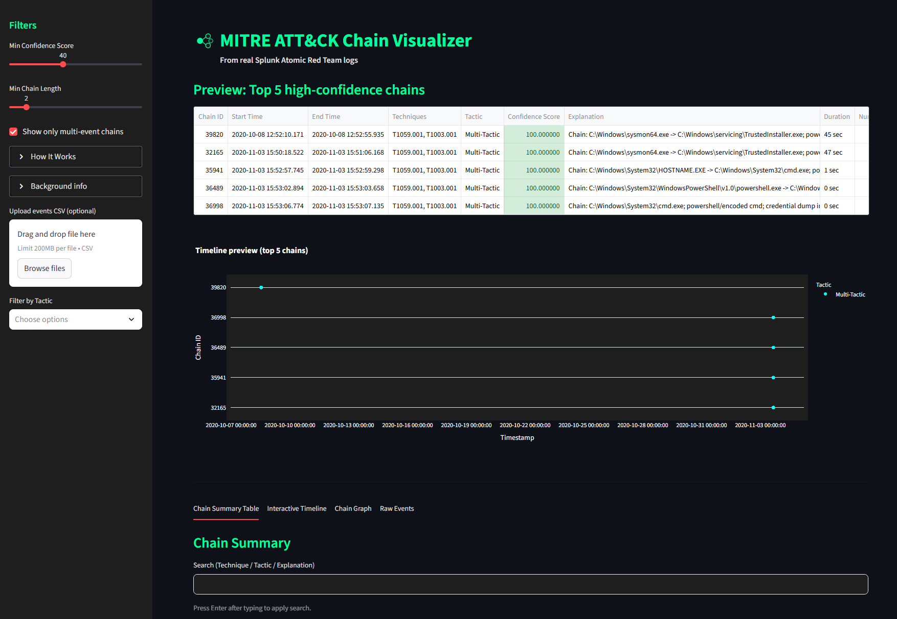

<h1 align="center">
  <picture>
    <source media="(prefers-color-scheme: dark)" srcset="docs/assets/logo-dark.svg">
    
  </picture>
</h1>

[](https://github.com/rvong65/mitre-attack-chain-visualizer/releases)
[](https://github.com/rvong65/mitre-attack-chain-visualizer/actions/workflows/tests.yml)
[](LICENSE)
[](https://github.com/rvong65/mitre-attack-chain-visualizer#features)
[](https://github.com/rvong65/mitre-attack-chain-visualizer#run-with-docker)
[](https://mitre-attack-chain-visualizer.streamlit.app/)

Process trees and event chains hide real attack behavior inside overwhelming EDR/Sysmon telemetry. This project groups related events into **scored, explainable attack chains**, maps them to MITRE ATT&CK techniques and tactics, and presents them on an interactive timeline—inspired by [SentinelOne Storyline](https://www.sentinelone.com/blog/rapid-threat-hunting-with-deep-visibility-feature-spotlight/) and [CrowdStrike Falcon](https://www.crowdstrike.com/platform/endpoint-security/falcon-insight-xdr/) behavioral graphing.

---

<details open>
<summary><strong>Table of Contents</strong></summary>

| Section | Description |
|---------|-------------|
| **Get started** | |
| 🚀 [Live Demo](#live-demo) | Try the Streamlit app (Cloud or local) |
| ✨ [Features](#features) | Capabilities at a glance |
| ⚡ [Quick Start](#quick-start) | Clone, install, run, test, Docker |
| **Overview** | |
| 🎯 [Problem & Motivation](#problem-motivation) | Why chain-level analysis matters |
| 🛠️ [Tech Stack](#tech-stack) | Languages, libraries, CI |
| 📊 [Data Sources & Attribution](#data-sources) | Splunk Attack Data (T1059.001, T1003.x, T1547.001) |
| 📌 [Version history](#version-history) | Release highlights |
| **Technical** | |
| 🏗️ [Architecture & Design Choices](#architecture-design-choices) | System design and pipeline |
| ↳ [Full architecture doc](docs/architecture.md) | Goals, system diagram, modules, deployment |
| ↳ [Development Journey](#development-journey) | Build timeline diagram |
| 🛡️ [Safety Considerations](#safety-considerations) | Ethics, guardrails, and data privacy |
| 🔄 [CI/CD](#cicd) | GitHub Actions and deployment |
| 📈 [Project Status & Build Log](#project-status) | Milestone checklist |
| 📁 [Repository Layout](#repository-layout) | File tree |
| **Legal & contact** | |
| 📄 [License](#license) | MIT + dataset attribution |
| 🤝 [Contact / Next Steps](#contact) | Feedback and roadmap |

</details>

---

<a id="live-demo"></a>

## 🚀 Live Demo

**[▶ Open the live app on Streamlit Cloud](https://mitre-attack-chain-visualizer.streamlit.app/)**

**Before you open the app:**
- **Cold start:** This app runs on Streamlit Community Cloud and may go to sleep after inactivity. If you see **“Zzzz — This app has gone to sleep due to inactivity”**, click **“Yes, get this app back up!”** to wake it — anyone can do this; you don’t need to contact the maintainer. Startup may take a minute after you click.
- **Privacy:** The app does not send your data to third-party AI, analytics, or external APIs. On this cloud demo, uploaded CSVs are processed in your session on Streamlit’s infrastructure — use [local or Docker](#run-with-docker) for sensitive telemetry. See [Privacy & data handling](#privacy-data-handling).

**Note:** The live app loads pre-built polished chains from `data/processed/`. Raw Splunk Attack Data logs are not included—download them separately to rebuild from scratch. You can also upload your own Sysmon/EDR CSV via the sidebar (recommended limit ~50 MB on Streamlit Cloud free tier).

**Screenshot:**



---

<a id="features"></a>

## ✨ Features

- **Pre-built polished chains included in repo** — explore attack chains immediately after clone; optional rebuild from Splunk Attack Data
- **Upload your own Sysmon/EDR CSV** — validation, size checks, graceful error handling
- **Filter by confidence, chain length, and tactic** — focus on high-signal activity
- **Interactive timeline** — Plotly scatter with hover explanations, cmdline snippets, tactic coloring
- **Per-chain process-tree graph** — parent–child storyline view for a selected chain
- **Chain summary table** — confidence-coded cells (green / yellow / red tiers)
- **Export filtered chains** — CSV summary or STIX 2.1 JSON bundle

**Expected upload columns** (minimum): `timestamp`, `process_path`, `cmdline`, `parent_process`.

---

<a id="quick-start"></a>

## Quick Start

### 1. Clone and install

```bash
git clone https://github.com/rvong65/mitre-attack-chain-visualizer.git
cd mitre-attack-chain-visualizer
python -m venv .venv
source .venv/bin/activate   # Windows: .venv\Scripts\activate
pip install -r requirements.txt
```

### 2. Run the dashboard

The repo includes **polished chain outputs** (`data/processed/events_with_chains_polished.csv` and `chains_summary_polished.csv`) so the app works immediately after clone—no raw logs required.

Activate `.venv` if it is not already active, then:

```bash
streamlit run app.py
```

Open **http://localhost:8501**.

<a id="run-with-docker"></a>

### 3. Docker (optional)

```bash
docker compose up --build
```

Open **http://localhost:8501**. The image bundles `app.py`, `src/`, polished demo CSVs, and branding assets.

### 4. Rebuild from raw logs (optional)

Raw Atomic Red Team logs are **not** committed (license/size). To regenerate all pipeline outputs:

1. Download logs from [Splunk Attack Data](https://github.com/splunk/attack_data) `atomic_red_team` subfolders for T1059.001, T1003.001, T1003.003, T1547.001.
2. Place files in `data/raw/<technique_id>/` (e.g. `data/raw/T1059.001/windows-sysmon.txt`).
3. With `.venv` active, run the pipeline:

```bash
python -c "from src.pipeline import run_pipeline; run_pipeline()"
python -m src.features.pipeline
python -m src.chain_detection
python -m src.chain_refine
python -m src.chain_polish
streamlit run app.py
```

Outputs are written to `data/processed/` (gitignored except the polished pair).

### Alternative: upload a CSV

Use the sidebar uploader with a Sysmon/EDR events CSV (`timestamp`, `process_path`, `cmdline`, `parent_process`)—no local pipeline required.

### Development (optional)

With `.venv` active:

```bash
pip install -r requirements-dev.txt
pytest tests/ -q
```

Loader and feature tests skip automatically when `data/raw/` or intermediate processed files are missing. Chain-detection, STIX export, and chain-graph tests run offline.

---

<a id="problem-motivation"></a>

## 🎯 Problem & Motivation

Signature-based detection and static indicators struggle with novel techniques and living-off-the-land binaries. SOC analysts still face thousands of disconnected process-creation events where the meaningful signal is the **sequence**: Execution → Credential Access → Persistence.

This project addresses that gap by:

- Grouping events into process chains via parent–child relationships and time proximity
- Mapping chains to MITRE ATT&CK with **confidence scores** and human-readable explanations
- Surfacing **multi-event chains** first—the highest-signal attack storylines
- Providing an analyst-friendly timeline, process-tree graph, filters, hover detail, and export

Interpretability and triage are built in. Confidence gating reduces noise; every highlighted chain includes context an analyst can act on—practical design for security operations workflows.

---

<a id="tech-stack"></a>

## 🛠️ Tech Stack


| Layer | Tools |
|-------|-------|
| **Data processing** | Python, Pandas, NumPy |
| **Visualization** | Plotly, Streamlit |
| **Detection** | Rule-based chain construction + weighted confidence scoring |
| **Integration** | STIX 2.1 JSON export |
| **Deployment** | [Streamlit Cloud](https://streamlit.io/cloud), Docker |
| **CI** | GitHub Actions (pytest + Docker smoke test) |

---

<a id="data-sources"></a>

## 📊 Data Sources & Attribution

This project uses curated attack simulation logs from the [Splunk Attack Data repository](https://github.com/splunk/attack_data) (Apache License 2.0).

**Datasets used** (from `atomic_red_team` subfolders):

| Technique | Name | Raw log sources |
|-----------|------|-----------------|
| **T1059.001** | Command and Scripting Interpreter: PowerShell | `windows-sysmon`, `windows-powershell` |
| **T1003.001** | OS Credential Dumping (LSASS) | `windows-sysmon`, `crowdstrike_falcon` |
| **T1003.003** | OS Credential Dumping (NTDS) | `windows-sysmon`, `crowdstrike_falcon` |
| **T1547.001** | Boot or Logon Autostart: Registry Run Keys | `windows-sysmon` |

**License compliance**  
- © Splunk Inc. (Apache 2.0). No affiliation with Splunk, CrowdStrike, SentinelOne, or MITRE.
- Data used solely for educational and research purposes.
- Full license: [Apache 2.0](https://www.apache.org/licenses/LICENSE-2.0).

**Raw logs are not committed.** Download them locally into `data/raw/<technique_id>/` (e.g. `data/raw/T1059.001/windows-sysmon.txt`) when rebuilding the pipeline from scratch.

---

<a id="version-history"></a>

## 📌 Version history

| Version | Highlights | Notes |
|---------|------------|-------|
| **[1.1.1](CHANGELOG.md#111---2026-06-25)** | Privacy & data-handling documentation | [Releases](https://github.com/rvong65/mitre-attack-chain-visualizer/releases) · [CHANGELOG](CHANGELOG.md#111---2026-06-25) |
| **[1.1.0](CHANGELOG.md#110---2026-06-22)** | Docker, STIX export, chain graph, architecture docs, branding | [CHANGELOG](CHANGELOG.md#110---2026-06-22) |
| **[1.0.0](CHANGELOG.md#100---2026-06-18)** | MVP pipeline, Streamlit Cloud, CI, polished demo data | Public since 2026-06-08; tagged 2026-06-18 · [CHANGELOG](CHANGELOG.md#100---2026-06-18) |

---

<a id="architecture-design-choices"></a>

## 🏗️ Architecture & Design Choices

Raw telemetry flows through ingest → optional features → chain detection/refinement → polish → the Streamlit dashboard (filters, timeline, process-tree graph, CSV/STIX export). Rule-based confidence and benign-root filtering keep output analyst-ready without black-box ML.

**Full design** — goals, end-to-end diagram, module map, deployment topologies (local / Docker / Streamlit Cloud), and architecture-level safety: **[docs/architecture.md](docs/architecture.md)**

**Key design decisions**

| Decision | Rationale |
|----------|-----------|
| Chain-level analysis | Techniques inferred from multi-event sequences—matching EDR storyline presentation |
| Rule-based confidence | Interpretable scoring with plain-language explanations |
| Confidence gating | Default ≥40% confidence and multi-event filters reduce noise |
| STIX export (MVP) | Attack-pattern refs and groupings for SIEM handoff without full observables scope |
| Reproducibility | Staged CSV artifacts; Docker image for one-command local run |

<a id="development-journey"></a>

### Development Journey

Pivoted from per-event ML (RandomForest, SMOTE) to chain-level detection after accuracy plateaued on overlapping PowerShell-heavy simulation data. Earlier experiments are in [`archived/`](archived/). Build timeline and deployment details: [docs/architecture.md](docs/architecture.md#development-journey).

---

<a id="safety-considerations"></a>

## 🛡️ Safety Considerations

| Principle | Implementation |
|-----------|----------------|
| **Simulation only — no live execution** | Uses static Splunk Attack Data / uploaded CSVs; no agents, network callbacks, or payload execution |
| **Support analyst judgment, not replace EDR** | Confidence scores and explanations are triage aids; the tool does not block, alert, or enforce policy in production environments |
| **Validate untrusted uploads** | File size limits (~50 MB guidance), parse error handling, schema checks, and fallback to built-in demo data on failure |
| **Protect sensitive telemetry** | Do not upload production EDR/SIEM exports to public Streamlit deployments without authorization; raw logs are not committed to the repo |

<a id="privacy-data-handling"></a>

### Privacy & data handling

This application **does not integrate third-party AI, analytics, or external APIs** that receive your uploaded data. Processing (filtering, charts, CSV/STIX export) runs in the Streamlit Python session only.

| Data you submit | Where it may be sent | Notes |
|-----------------|----------------------|-------|
| **Built-in demo CSVs** | Nowhere (read from the repo/image) | Default view uses committed polished chains in `data/processed/` |
| **CSV you upload — local or Docker** | Stays on your machine | Parsed in memory; exports download to your browser only |
| **CSV you upload — Streamlit Cloud** | [Streamlit Community Cloud](https://streamlit.io/cloud) hosting | Session-scoped processing on Streamlit’s servers; **not** forwarded to this app’s code as outbound API calls |
| **CSV / STIX exports you download** | Your device only | Generated in-session; you control where files are saved |

**Not in scope of this app:** Streamlit’s own platform telemetry, browser/CDN delivery of Plotly/Streamlit assets, or your organization’s network policies. For production or classified telemetry, run locally or via Docker.

---

<a id="cicd"></a>

## 🔄 CI/CD

**GitHub Actions** ([`.github/workflows/tests.yml`](.github/workflows/tests.yml)) on every push and PR to `main` / `master`:

| Job | Steps |
|-----|-------|
| **test** | Python 3.11 → `pip install -r requirements-dev.txt` → `pytest tests/ -q` |
| **docker** | `docker build` → run container → `curl` Streamlit `/_stcore/health` |

**Streamlit Cloud** deploys independently from `main` (`app.py` + `requirements.txt`).

---

<a id="project-status"></a>

## 📈 Project Status & Build Log

| Step | Focus | Status |
|------|-------|--------|
| **1 — Data** | Load and unify Sysmon, PowerShell, and Falcon logs; unified schema | ✅ |
| **2 — Features** | Cmdline patterns, parent–child links, technique-specific signals | ✅ |
| **3 — Pivot** | Archived per-event ML; shifted to chain-level detection | ✅ |
| **4 — Chains** | Parent–child + time proximity grouping; technique rules | ✅ |
| **5 — Refine** | Confidence scoring, benign filtering, explanations | ✅ |
| **6 — Polish** | Tactic colors, summary tables, multi-event gating | ✅ |
| **7 — UI** | Streamlit dashboard: dark theme, filters, timeline, export | ✅ |
| **8 — Deploy** | Upload validation, Streamlit Cloud | ✅ |
| **9 — CI** | GitHub Actions pytest workflow | ✅ |
| **10 — v1.1** | Docker, STIX export, chain graph, docs, branding, releases | ✅ |
| **11 — v1.1.1** | Privacy & data-handling documentation (README, app, architecture) | ✅ |

**Current status:** ✅ v1.1.1 — privacy documentation; v1.1.0 features (Docker, STIX, chain graph) on Streamlit Cloud.

---

<a id="repository-layout"></a>

## 📁 Repository Layout

```
mitre-attack-chain-visualizer/
├── app.py                         # Streamlit dashboard (Streamlit Cloud entry point)
├── Dockerfile                     # Container image for local / reproducible runs
├── docker-compose.yml             # One-command docker compose up
├── CHANGELOG.md                   # Version-by-version change history
├── requirements.txt               # Runtime dependencies
├── requirements-dev.txt           # Dev deps (pytest); local & CI only
├── LICENSE                        # MIT License
├── README.md                      # Project overview
├── .gitignore                     # Raw logs, .venv, intermediate processed outputs
├── .dockerignore                  # Docker build context exclusions
├── .github/
│   └── workflows/tests.yml        # pytest + Docker smoke test on push/PR
├── docs/
│   ├── architecture.md            # Goals, diagram, modules, deployment, safety
│   ├── assets/                    # logo.svg, logo-dark.svg, icon.svg, favicon.svg
│   └── screenshots/               # README demo images
├── data/
│   ├── raw/                       # Local only (gitignored) — Splunk Attack Data logs
│   └── processed/                 # Polished demo CSVs committed; rest gitignored
├── src/
│   ├── pipeline.py                # Load & normalize raw logs
│   ├── schema.py                  # Unified event schema
│   ├── config.py                  # Paths, technique IDs, defaults
│   ├── chain_detection.py         # Union-find chain building
│   ├── chain_refine.py            # MITRE rules, confidence, explanations
│   ├── chain_polish.py            # UI-ready polish & gating
│   ├── chain_graph.py             # Per-chain process-tree Plotly graph
│   ├── stix_export.py             # STIX 2.1 bundle builder
│   ├── timeline_viz_helpers.py    # Timeline helpers
│   ├── features/                  # Optional feature enrichment
│   └── loaders/                   # Sysmon, Falcon, PowerShell parsers
├── archived/                      # Per-event ML experiments (source only)
└── tests/                         # pytest suite (offline smoke tests)
```

Local virtualenv (`.venv/`) is gitignored — create and activate it per [Quick Start](#quick-start).

---

<a id="license"></a>

## 📄 License

**MIT License** — see [LICENSE](LICENSE).

Dataset attribution and license (Splunk Attack Data, Apache 2.0) are described in [Data Sources & Attribution](#data-sources). Data used solely for **educational and research purposes**. No affiliation with Splunk, CrowdStrike, SentinelOne, or MITRE.

---

<a id="contact"></a>

## 🤝 Contact / Next Steps

Open to feedback, suggestions, and mission-aligned collaboration.

**Potential future directions** *(no promises on timeline)*:

- TAXII feed ingestion for STIX bundles
- Graph-database backend for large-scale chain queries
- LLM-assisted chain summarization (with guardrails)
- Additional Atomic Red Team techniques and data sources
- Upload column mapping UI for heterogeneous EDR exports

---

<p align="center">
  <sub>Built with real Splunk Atomic Red Team telemetry · MITRE ATT&CK® is a registered trademark of The MITRE Corporation</sub>
</p>
