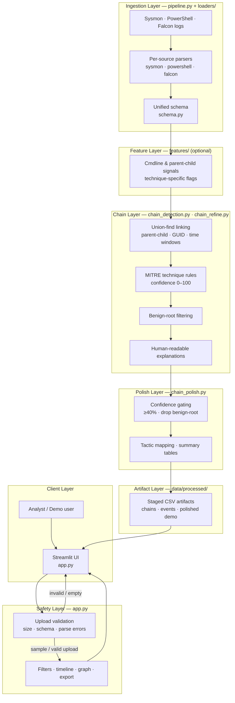

# Architecture & Design Choices

Full system design for the MITRE ATT&CK Chain Visualizer pipeline and Streamlit application.

---

## Goals

| Goal | Approach |
|------|----------|
| Surface multi-stage attack **storylines** | Union-find chain linking on parent–child process relationships and time windows |
| Map chains to **MITRE ATT&CK** with analyst trust | Rule-based technique detection, 0–100 confidence scores, plain-language explanations |
| Reduce triage noise | Benign-root filtering, default ≥40% confidence gate, multi-event-only view |
| **Visual explainability** | Plotly timeline, per-chain process-tree graph, tactic-colored nodes |
| **SIEM handoff (MVP)** | STIX 2.1 bundle export (attack-patterns, relationships, groupings) |
| **Reproducibility** | Staged CSV pipeline artifacts; polished demo data in git; Docker image |

---

## End-to-end system diagram

---

## Repository modules

| Module | Role |
|--------|------|
| `app.py` | Streamlit entry point — filters, timeline, chain graph, CSV/STIX export |
| `src/pipeline.py` | Orchestrate raw log loading and normalization |
| `src/loaders/` | Sysmon, Falcon, PowerShell parsers |
| `src/schema.py` | Unified event column definitions |
| `src/config.py` | Paths, technique IDs, defaults |
| `src/features/` | Optional cmdline and parent–child feature flags |
| `src/chain_detection.py` | Union-find chain building |
| `src/chain_refine.py` | MITRE rules, confidence, explanations |
| `src/chain_polish.py` | UI gating, tactic colors, summary tables |
| `src/chain_graph.py` | Per-chain process-tree Plotly graph |
| `src/stix_export.py` | STIX 2.1 bundle builder for filtered chains |
| `src/timeline_viz_helpers.py` | Timeline and summary helpers |
| `archived/` | Early per-event ML classification experiments (source only) |

---

## Pipeline summary

Raw logs (Sysmon, PowerShell, CrowdStrike Falcon) are loaded and normalized ([`src/pipeline.py`](../src/pipeline.py), [`src/loaders/`](../src/loaders/)) into a unified schema (`timestamp`, `process_path`, `parent_process`, `cmdline`, `technique_id`, etc.). Optional feature engineering ([`src/features/`](../src/features/)) enriches events with cmdline and parent–child signals.

**Chain detection** ([`src/chain_detection.py`](../src/chain_detection.py)) groups events via union-find and time proximity. **Refinement** ([`src/chain_refine.py`](../src/chain_refine.py)) applies GUID-first linking, technique rules, confidence scoring, benign-root filtering, and explanations. **Polish** ([`src/chain_polish.py`](../src/chain_polish.py)) gates chains for the UI and builds summary tables.

The **Streamlit** dashboard ([`app.py`](../app.py)) loads polished chains or uploaded CSVs, filters by confidence/length/tactic, renders an interactive timeline and per-chain process-tree graph, and exports CSV or STIX 2.1 JSON.

### Pipeline outputs

`data/processed/` — only polished files are committed:

| Stage | Events | Summary |
|-------|--------|---------|
| Chain detection | `events_with_chains.csv` | `chains_summary.csv` |
| Refined | `events_with_chains_refined.csv` | `chains_summary_refined.csv` |
| Polished (UI-ready, **committed**) | `events_with_chains_polished.csv` | `chains_summary_polished.csv` |

---

## Key design decisions

| Decision | Rationale |
|----------|-----------|
| Chain-level analysis | Techniques and tactics are inferred from multi-event sequences—not isolated rows—matching how EDR storylines present attacks |
| Rule-based confidence | Interpretable scoring (base + sequence bonuses) with plain-language explanations; avoids black-box ML on overlapping simulation data |
| Confidence gating | Default filters (≥40% confidence, multi-event only) surface analyst-ready storylines and reduce Splunk/Windows noise |
| Benign-root filtering | Chains rooted in benign processes (e.g. svchost, splunkd) without suspicious indicators are excluded from the polished view |
| Reproducibility | Pipeline writes staged CSVs under `data/processed/`; only polished demo outputs are committed to GitHub |
| STIX export (MVP) | Attack-pattern refs and grouping objects for SIEM integration without full observables scope in v1.1 |

---

## Development journey

Initially explored per-event rule-based and ML classification approaches (RandomForest, ensembles, SMOTE). While some signals were captured, accuracy plateaued due to heavy event overlap and PowerShell dominance in the Atomic Red Team data. Pivoted to process chain detection and timeline visualization—a more practical, industry-aligned solution that better surfaces meaningful multi-stage attack sequences (Execution → Credential Access → Persistence), mirroring tools like SentinelOne Storyline and CrowdStrike Threat Graph. Earlier classification experiments are preserved in [`archived/`](../archived/).

```mermaid
flowchart LR
    A[Multi-source log ingest<br/>Sysmon · PowerShell · Falcon] --> B[Per-event ML experiments<br/>rules · RF · SMOTE]
    B --> C[Pivot to chain detection<br/>union-find · time windows]
    C --> D[Refinement<br/>confidence · benign filter · explanations]
    D --> E[Polish & tactic mapping<br/>UI-ready summaries]
    E --> F[Streamlit UI<br/>dark theme · filters · timeline]
    F --> G[Upload validation<br/>polished demo CSVs]
    G --> H[Streamlit Cloud deploy<br/>MVP live]
    H --> I[GitHub Actions tests<br/>offline pytest]
    I --> J[v1.1 Docker · STIX · chain graph]
```

---

## Deployment topologies

### Local development

1. Create and activate `.venv`, then `pip install -r requirements.txt`.
2. Run `streamlit run app.py` — loads committed polished CSVs from `data/processed/`.
3. Optional: `pip install -r requirements-dev.txt` and `pytest tests/ -q` before changes.
4. Optional pipeline rebuild from `data/raw/` Splunk Attack Data (see README Quick Start).

**Runtime:** Python 3.11+ recommended; app binds to `http://localhost:8501`.

### Docker

1. `docker compose up --build` from repo root.
2. Image includes `app.py`, `src/`, polished demo CSVs, and `docs/assets/` branding.
3. Streamlit listens on `0.0.0.0:8501` with health check at `/_stcore/health`.

**Use when:** you want a reproducible environment without managing a local venv, or to mirror CI smoke tests.

### Streamlit Cloud

- Entry point: `app.py`; dependencies: `requirements.txt`.
- Deploys from `main` when the repo is connected to [Streamlit Cloud](https://streamlit.io/cloud).
- Uses committed polished data only — no raw Splunk logs in the container.
- Cold starts may require waking the app from sleep (see README Live Demo).

**CI note:** GitHub Actions runs pytest and Docker smoke tests independently of Streamlit Cloud redeploy.

---

## Security & safety (architecture-level)

| Concern | Mitigation |
|---------|------------|
| **No live attack execution** | Pipeline and app consume static CSV/JSON logs; no payload delivery or callback infrastructure |
| **Untrusted CSV uploads** | Parse validation, required-column checks, graceful fallback to built-in demo data on failure |
| **Analyst vs. enforcement** | Scores and explanations support triage only — no blocking, alerting, or policy enforcement |
| **Sensitive telemetry** | Operators should not upload production EDR exports to public deployments; raw logs stay gitignored |
| **STIX export scope** | MVP bundles reference MITRE technique IDs and chain metadata — not full process/file observables or raw cmdlines as STIX objects |
| **Supply chain** | Runtime deps pinned in `requirements.txt`; Docker and CI rebuild on every push |

### Privacy & data handling

The application code does **not** call external APIs with user-supplied data (no LLM, analytics SDKs, or SIEM upload integrations). Uploaded CSVs are parsed in the Streamlit session; exports are generated for browser download only.

| Concern | Behavior |
|---------|----------|
| **Local / Docker runtime** | Uploads and processing stay on the operator’s machine (or container); no app-level outbound data sharing |
| **Streamlit Cloud runtime** | Uploads exist in the hosted session on Streamlit’s infrastructure; users should avoid production telemetry on the public demo |
| **Built-in demo data** | Loaded from committed polished CSVs in the repository or Docker image |
| **STIX / CSV export** | Artifacts are built in-session and downloaded by the user; not auto-uploaded anywhere |
| **Third-party services** | No MITRE, Splunk, or AI vendor APIs receive user files from this codebase; standard browser/CDN loading of Streamlit/Plotly assets may still apply |

---

## Version

**Document version:** v1.1.1 (privacy documentation). See [README → Version history](../README.md#version-history).

| Release | Architecture highlights |
|---------|-------------------------|
| **1.1.1** | Privacy & data-handling documentation (README, app sidebar, architecture) |
| **1.1.0** | Docker topology, STIX export path, chain graph, split architecture doc, branding assets |
| **1.0.0** | Chain pipeline, Streamlit MVP, polished demo data, pytest CI |
